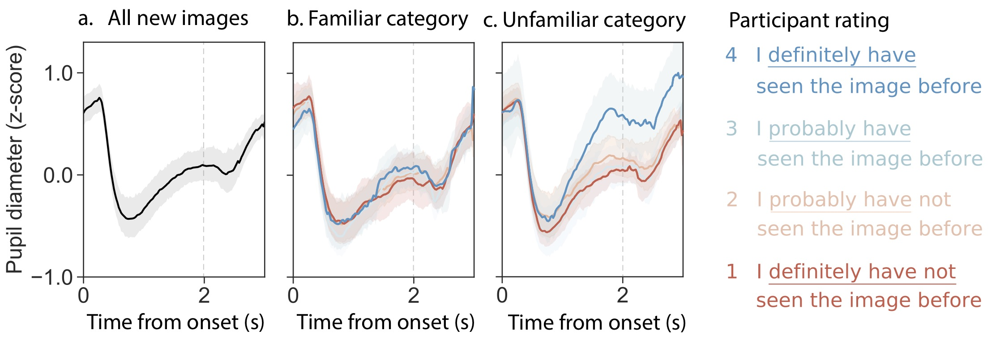

# Analyses: Familiarity alters pupil dilation response to new items

This repository contains all of the materials for creating the analyses and plots in our manuscript <i>Familiarity alters pupil dilation response to new items</i> (under review at ....<!--a href ="https://elifesciences.org/">eLife</a-->). To replicate our analyses, see `code/README.md`.

<b>Abstract:</b> Our sense of remembering (or not remembering) things we encounter is reflected by changes in our pupil size. That is, our pupils dilate differently when we encounter things that seem old (remembered) versus things that seem new (not remembered), even when our memory is wrong. This <i>subjective pupil old/new effect</i> is challenging to interpret because multiple processes (perception, memory, decision-making) can influence pupil dilation. One proposed influence is the interaction between expectation and recognition memory (e.g. the surprise of recognizing someone you know while traveling in a remote location). Recognizing things "by surprise" (e.g. while traveling) reportedly boosts the effect, and recognizing things when you expect them (e.g. at home) extinguishes it. Here, however, we find similar pupil dilation responses to items that are expectation-neutral and do not exist in memory. These items have not been seen before, but <i>feel</i> either familiar (extinguished effect) or unfamiliar (boosted effect) based on category. This demonstrates that familiarity yields pupil dilation responses similar to those associated with expectation and memory. 

<i> Keywords: familiarity, recognition memory, pupil dilation response, attention</i>

<b>Key figure:</b> 

 

<b>Pupil dilation response to new images, grouped by category (panels) and rating (colors).</b> All panels display pupil dilation responses to new images presented in the Variable Attention experiment during a two-second image-display period (left of grey line) followed by a one-second fixation period (right of grey line). <b>a)</b> Average pupil dilation response to new images. <b>b)</b> Average pupil dilation response to new images in the familiar category (scenes), colored by participant rating. <b>c)</b> Average pupil dilation response to new images in the unfamiliar category (faces), colored by participant rating.
